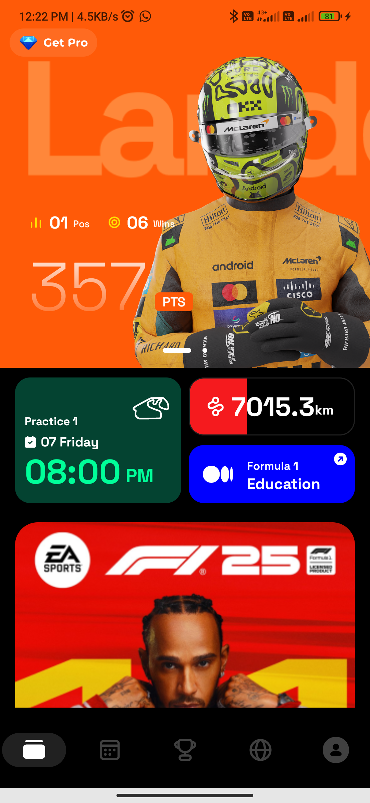
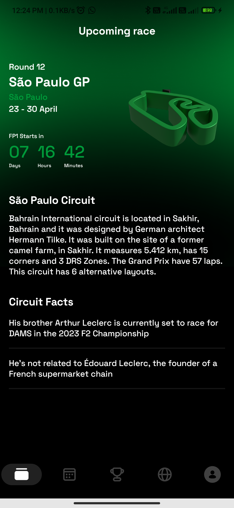

# 🚀 F1 Mobile App: Modern Android Development Showcase

This is a single-module Android application demonstrating a robust, maintainable architecture using **Jetpack Compose** for UI and **Ktor** for networking.  
The project is designed to fetch and display Formula 1 data, focusing on clean separation of concerns and elegant UI design.

---

## 🖼️ App Screenshots

| Home Screen 1 | Home Screen 2 | Upcoming Race Screen |
|----------------|----------------|----------------------|
|  |  |  |


> 📸 These screenshots demonstrate the dynamic UI — including gradient backgrounds, paged race highlights, and real-time upcoming race information.

---

## 🎯 Architecture & Technologies

The project follows the **MVVM (Model-View-ViewModel)** architectural pattern using a modern Android stack:

| Concept | Technology Used | Rationale / Benefit |
| :--- | :--- | :--- |
| **UI Layer** | **Jetpack Compose** | Declarative, reactive UI development with less boilerplate. |
| **Networking** | **Ktor Client** | Lightweight, coroutine-based HTTP client for async API calls. |
| **Dependency Injection** | **Hilt** | Simplifies dependency management and promotes testability. |
| **State Management** | **Kotlin Flows (`StateFlow`)** | Reactive state handling for ViewModel–UI communication. |
| **Navigation** | **Compose Navigation** | Handles screen transitions and back-stack management cleanly. |

---

## 📂 Key Components Overview

| Layer | File | Responsibility |
|-------|------|----------------|
| **Data Layer** | `data/remote/ApiService.kt` | Defines Ktor-based suspend functions for network requests. |
|  | `data/repository/HomeRepository.kt` | Acts as a single source of truth for remote data. |
| **Domain Layer** | *(Optional in MVVM)* | Logic handled within the ViewModel for simplicity. |
| **ViewModel Layer** | `ui/screens/home_screen/HomeViewModel.kt` | Fetches and exposes data via `UiState` using `StateFlow`. |
| **UI Layer** | `ui/screens/home_screen/HomeScreen.kt` | Displays driver details, race sessions, and upcoming race. |
| **App Entry** | `MainActivity.kt` | Initializes Hilt, navigation graph, and bottom bar structure. |

---

## ⚙️ Getting Started

1. **Clone the repository**
   ```bash
   git clone https://github.com/aemy18/RaceApp-JetpackCompose.git


**Developed by: Amit Padhar**